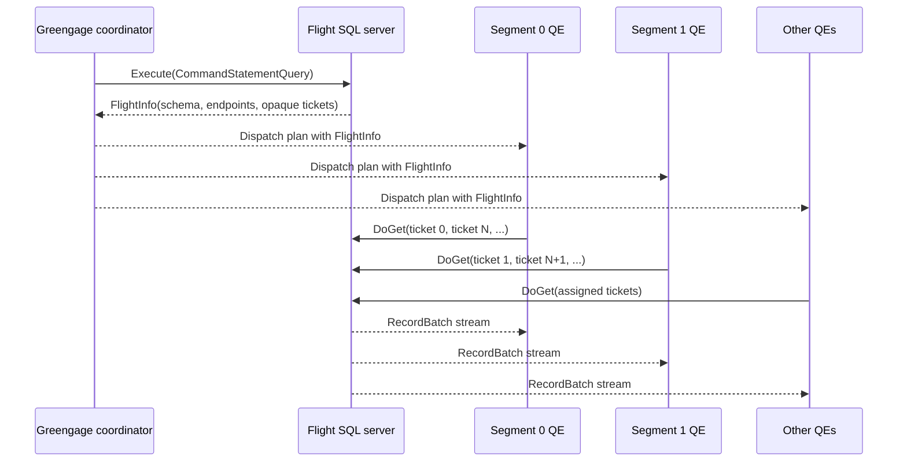
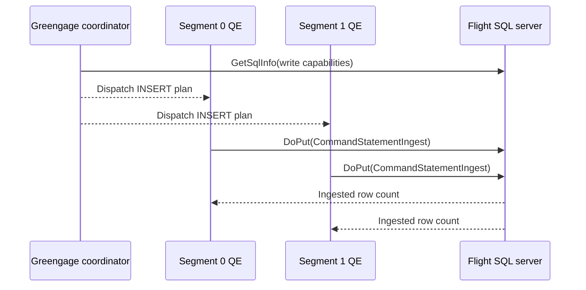
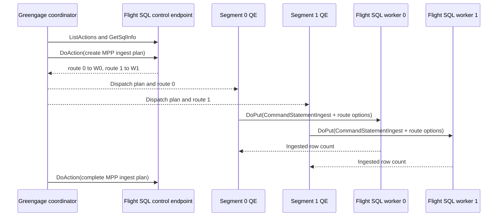

# Arrow Flight SQL FDW

`gpcontrib/arrowflight` provides `flightsql_fdw`, an experimental Greengage foreign data wrapper for databases and
services that implement Apache Arrow Flight SQL.

The FDW uses the standard Flight SQL protocol:

- reads use `CommandStatementQuery`, `FlightInfo`, and `DoGet`;
- writes use `CommandStatementIngest`;
- transactional writes use the Flight SQL transaction API when the server advertises all required capabilities.

A foreign server connects to the Flight SQL endpoint exposed by the remote database or service.

## Why This Exists

Text-oriented exchange such as CSV formats typed values on the producer and parses them again on every Greengage
segment. Arrow Flight SQL transports typed columnar batches directly over gRPC. For suitable workloads this reduces
formatting work, network bytes, and CPU consumption while retaining parallel I/O on Greengage segments.

In the measured ARM64 workload described below, ClickHouse Flight SQL was
`1.89x` faster than `gpfdist` CSV for reads and `2.40x` faster for writes. Total CPU was about half for reads and `22%`
lower for writes. The synthetic server, which isolates protocol and FDW overhead from database execution, was faster
still. Greengage network traffic per row was about `25%` lower for reads and `28%` lower for writes.

## Architecture

### Read

The coordinator opens the remote statement once when execution starts. The returned `FlightInfo` contains opaque tickets
and optional endpoint locations. It is serialized into the dispatched plan, and query executors consume the assigned
endpoints directly.



For `N` Greengage primary segments, endpoint `i` is assigned to segment
`i % N`.

- Fewer endpoints than segments are valid; some QEs receive no stream.
- More endpoints than segments are valid; a QE consumes several streams sequentially.
- Zero endpoints represent an empty result.

The endpoint count therefore bounds read parallelism. A server that returns one endpoint uses one QE for the remote
stream even though the foreign scan is planned on all segments. To use all `N` segments concurrently, the server must
return at least `N` independently consumable endpoints.

Greengage represents the source scan with a `Strewn` locus. Endpoint assignment balances Flight streams independently of
Greengage table distribution, so the planner adds Motion when a later operation requires a specific distribution.

The remote SQL selects only columns required by the local plan and includes predicates from the portable subset
described below. Filter columns that are not otherwise needed are not returned. `EXPLAIN` shows the generated Flight SQL
query without executing it.

Predicate pushdown is intentionally conservative because Flight SQL servers may use different SQL dialects. The FDW
pushes:

- `AND`, `OR`, and `NOT`;
- `=`, `<>`, `<`, `<=`, `>`, and `>=` for integers, numeric, date, and whole-second timestamp literals without time
  zone;
- `=` and `<>` for boolean, finite floating-point, text, varchar, and enum values;
- `IS NULL` and `IS NOT NULL` on columns, bare boolean columns, boolean
  `IS UNKNOWN` null tests, and constant `IN`/`NOT IN` lists with at most 1000 non-null values.

Functions, expression casts, parameters, boolean `IS TRUE` tests, time and fractional-timestamp literals, string
ordering, `char`, timezone-dependent timestamps, and non-portable types remain local. Lists containing `NULL` also
remain local because `NOT IN` null semantics differ between SQL engines. Conjuncts are classified separately, so a
supported `id > 0` is still pushed when another `AND` conjunct uses an unsupported function. An `OR` is pushed only when
every branch is safe. Set `predicate_pushdown=false` on a server or table to keep all predicates in Greengage.

### Write

Rows reach QEs according to the Greengage plan. Each QE that receives rows opens one standard `CommandStatementIngest`
stream. The FDW has two explicit write-routing modes.

`origin`, the default, sends every stream to the foreign server's configured
`host` and `port`. A remote load balancer or distributed table is responsible for spreading those streams across service
nodes.



`planned` is an opt-in MPP extension for services that advertise the
`greengage.flight.sql.mpp_ingest.v1.*` Flight actions. Before dispatch, the coordinator creates one query-scoped plan
and receives one direct route for each Greengage segment. Each active QE then sends its standard ingest command directly
to its assigned worker. The plan id and route token are carried in the command's backend-specific options; the Arrow
data stream remains standard Flight SQL.



`planned` never falls back to `origin`. Missing actions, an invalid route count, a stale lease, a mismatched TLS mode,
or an unsupported transaction scope fails the statement. No Arrow rows are sent until capability discovery, transaction
setup when required, and plan validation have succeeded.

`write_transaction_mode` controls failure semantics:

- `auto_commit` is the default. Every QE ingest is independent. If one stream fails after another stream commits, the
  remote table can contain a partial result.
- `required` asks the server for its Flight SQL capabilities before data transfer. The coordinator begins one remote
  transaction, passes its opaque transaction ID to every QE ingest, rolls it back on Greengage abort, and commits it
  during Greengage `PRE_COMMIT`. The statement fails before streaming if the server does not explicitly advertise bulk
  ingest and transaction support.

With `write_routing_mode=planned`, `required` additionally requires the plan response to declare
`transaction_scope=cluster`. This proves that the transaction handle created at the control endpoint is valid at every
direct worker route.

This makes the remote QE streams all-or-nothing, but it is not an XA transaction between Greengage and the remote
database. A failure after the remote `PRE_COMMIT` succeeds but before the local commit completes can leave the two
systems inconsistent. Prepared distributed transactions are rejected. Do not use `auto_commit` where even remote-stream
atomicity is required.

#### Planned write service contract

A service supporting `write_routing_mode=planned` must list all three actions:

```text
greengage.flight.sql.mpp_ingest.v1.create
greengage.flight.sql.mpp_ingest.v1.complete
greengage.flight.sql.mpp_ingest.v1.abort
```

Their request and response messages are defined in
`src/proto/flightsql_mpp.proto`. The create response must contain one unique, unexpired route for every current
Greengage primary segment. For transactional ingest it must also declare cluster transaction scope.

Every QE sends the following backend-specific
`CommandStatementIngest.options` to its assigned worker:

```text
greengage.mpp.version
greengage.mpp.plan_id
greengage.mpp.route_token
greengage.mpp.segment_index
greengage.mpp.segment_count
greengage.mpp.client_operation_id
greengage.mpp.schema_fingerprint
```

The worker must validate the plan state, route token, segment identity, target, schema fingerprint, lease, and
transaction association before accepting rows. `complete` and `abort` must be idempotent. Greengage does not retry an
ingest stream after `ExecuteIngest` starts.

### Resource Cleanup

Active readers and writers are registered with the Greengage
`ResourceOwner`. Query cancellation, errors, and transaction abort close Flight streams and release client resources.
Read rescans are not supported; a plan that requires rescan fails instead of replaying an already consumed stream.

## SQL Contract

Create the extension and one foreign server:

```sql
CREATE EXTENSION arrowflight;

CREATE SERVER analytics_flightsql
    FOREIGN DATA WRAPPER flightsql_fdw
    OPTIONS (
        mpp_execute 'all segments',
        host 'clickhouse.example.internal',
        port '9005',
        timeout_ms '60000'
        );
```

The extension declares `mpp_execute 'all segments'` as the FDW default, so foreign servers inherit segment execution
when the option is omitted. It is shown explicitly above to make the deployment contract visible. A server or table
override that selects coordinator execution is rejected because it would remove segment-parallel data transfer.

Create a foreign table for a remote object:

```sql
CREATE FOREIGN TABLE analytics_events (
    event_id bigint OPTIONS (column_name 'id'),
    label text,
    active boolean,
    created_at timestamptz
    )
    SERVER analytics_flightsql
    OPTIONS (
        catalog_name 'default',
        schema_name 'analytics',
        table_name 'events',
        rows '10000000'
        );
```

The same foreign table can be selected from and inserted into if the remote Flight SQL server supports both operations:

```sql
SELECT event_id, label
FROM analytics_events
WHERE active;

INSERT INTO analytics_events
SELECT id, label, active, created_at
FROM local_events;
```

The `rows` option is only a planner estimate. It does not limit the number of rows returned.

## Options

### Foreign Server

| Option                        |        Default | Description                                                                                                                                                           |
|-------------------------------|---------------:|-----------------------------------------------------------------------------------------------------------------------------------------------------------------------|
| `host`                        |       required | Flight SQL host name or address.                                                                                                                                      |
| `port`                        |       required | Flight SQL port.                                                                                                                                                      |
| `mpp_execute`                 | `all segments` | Inherited from the FDW; any coordinator override is rejected.                                                                                                         |
| `tls`                         |        `false` | Use a TLS Flight connection.                                                                                                                                          |
| `tls_ca_file`                 |           none | PEM CA used to verify the server certificate.                                                                                                                         |
| `tls_client_cert_file`        |           none | PEM client certificate for mTLS. Must be paired with the client key.                                                                                                  |
| `tls_client_key_file`         |           none | PEM client private key for mTLS. Must be paired with the client certificate.                                                                                          |
| `auth_token_file`             |           none | File containing a Bearer token sent with Flight RPCs.                                                                                                                 |
| `endpoint_location_allowlist` |           none | Comma-separated exact `grpc+tcp://host:port` or `grpc+tls://host:port` locations allowed in `FlightInfo`. Without it, only the configured server location is allowed. |
| `timeout_ms`                  |           `-1` | Flight RPC timeout in milliseconds; `-1` means no deadline.                                                                                                           |
| `max_endpoints`               |        `10000` | Maximum endpoints accepted in one `FlightInfo`.                                                                                                                       |
| `max_plan_bytes`              |     `16777216` | Maximum serialized `FlightInfo` or MPP ingest plan size dispatched to QEs.                                                                                            |
| `batch_rows`                  |         `8192` | Maximum rows per outgoing ingest batch.                                                                                                                               |
| `max_batch_bytes`             |      `4194304` | Approximate outgoing batch byte limit; `0` disables the byte threshold.                                                                                               |
| `ingest_row_count_check`      |        `exact` | `exact` verifies the server-reported row count; `off` skips the check.                                                                                                |
| `write_transaction_mode`      |  `auto_commit` | `auto_commit` or `required`.                                                                                                                                          |
| `write_routing_mode`          |       `origin` | `origin` sends every ingest to the configured server; `planned` requires the MPP ingest action extension and direct per-segment routes.                               |
| `predicate_pushdown`          |         `true` | Push the portable predicate subset into remote read SQL.                                                                                                              |

Connection and security options are server-only. TLS/auth file options require
`tls=true`; the client certificate and key must be configured together.

### Foreign Table

| Option                   |         Default | Description                                          |
|--------------------------|----------------:|------------------------------------------------------|
| `table_name`             |        required | Remote table name used by query and ingest commands. |
| `schema_name`            |            none | Remote schema name.                                  |
| `catalog_name`           |            none | Remote catalog name.                                 |
| `rows`                   |          `1000` | Planner row-count estimate.                          |
| `batch_rows`             |  server/default | Per-table ingest batch row limit.                    |
| `max_batch_bytes`        |  server/default | Per-table ingest batch byte limit.                   |
| `ingest_row_count_check` |  server/default | Per-table row-count verification mode.               |
| `write_transaction_mode` |  server/default | Per-table transaction requirement.                   |
| `write_routing_mode`     | server/`origin` | Per-table write routing mode.                        |
| `predicate_pushdown`     |   server/`true` | Per-table override for remote predicate evaluation.  |

### Foreign Column

| Option        |           Default | Description                                                 |
|---------------|------------------:|-------------------------------------------------------------|
| `column_name` | local column name | Remote column name used in generated SQL and ingest fields. |

Foreign-table options identify the remote catalog, schema, table, and columns. The FDW quotes those identifiers when it
generates SQL, and obtains Flight tickets from the server's `FlightInfo`.

## Security

`flightsql_fdw` is a Flight SQL client. It protects client connections, but the remote server remains responsible for
validating credentials and authorizing queries and ingest operations.

The client supports:

- TLS with normal server certificate and hostname verification;
- a private CA from `tls_ca_file`;
- mTLS with a PEM client certificate and private key;
- a pre-issued Bearer token in the `Authorization` header of statement, endpoint, ingest, capability, transaction, and
  MPP action RPCs.

Plaintext is the default and is intended for isolated development environments. A production server should normally use
all four security files:

```sql
CREATE SERVER analytics_flightsql
    FOREIGN DATA WRAPPER flightsql_fdw
    OPTIONS (
        host 'flight-router.example.internal',
        port '9005',
        tls 'true',
        tls_ca_file '/etc/greengage/flightsql/ca.pem',
        tls_client_cert_file '/etc/greengage/flightsql/client.pem',
        tls_client_key_file '/etc/greengage/flightsql/client.key',
        auth_token_file '/etc/greengage/flightsql/token',
        endpoint_location_allowlist
        'grpc+tls://flight-worker-1.example.internal:9005,grpc+tls://flight-worker-2.example.internal:9005',
        timeout_ms '60000'
        );
```

The server location from `host` and `port` is always trusted. Every different location advertised in `FlightInfo` must
match
`endpoint_location_allowlist` exactly. This prevents a remote server from redirecting segment QEs, together with their
Bearer header and mTLS identity, to an unconfigured host. The allowlist transport must match `tls`: use
`grpc+tls` with TLS and `grpc+tcp` without it. Certificate SANs must cover the configured host and every allowlisted TLS
endpoint host.

Planned writes apply the same TLS, mTLS, and Bearer settings to the control endpoint and every direct worker route. The
plan is rejected if a route changes the configured TLS mode. Certificates used by direct workers must cover their
advertised host names.

The credentials are one service identity shared by all users of the foreign server; the FDW does not implement
`USER MAPPING`, username/password authentication, Flight `Handshake`, OAuth/OIDC, or per-user tokens. The remote Flight
SQL server must enforce table and operation permissions for that service identity.

Store token and private-key files with service-user-only permissions. The same paths must exist on the coordinator and
every segment host: the coordinator opens statements and discovers capabilities, while QEs perform `DoGet` and ingest
calls. File contents are loaded when a client is created, so replacing a file affects new operations but not active
streams.

DDL stores credential file paths, while credential contents remain in those files and are omitted from FDW-generated
diagnostics. The serialized
`FlightInfo`, including opaque tickets, is dispatched from the coordinator to QEs for `DoGet`; diagnostics report only
ticket byte lengths. `EXPLAIN`
displays generated remote SQL, including pushed literal values, so access to plans and database logs should follow the
same policy as access to query text.

## Type Support

Unsupported local Greengage types are rejected during planning, before the FDW opens a remote statement or ingest
stream. On reads, the returned Arrow schema is validated before any row is decoded:

| Greengage type            | Arrow representation                               |
|---------------------------|----------------------------------------------------|
| `bool`                    | Boolean                                            |
| `int2`, `int4`, `int8`    | Int16, Int32, Int64                                |
| `float4`, `float8`        | Float32, Float64                                   |
| `numeric(p,s)`            | Decimal128; writes require `p <= 38`               |
| `text`, `varchar`, `char` | String/LargeString                                 |
| `bytea`                   | Binary/LargeBinary                                 |
| `date`                    | Date32/Date64                                      |
| `time`                    | Time32/Time64                                      |
| `timestamp`               | Timestamp without timezone                         |
| `timestamptz`             | Timestamp with empty, `UTC`, or `Etc/UTC` timezone |
| `uuid`                    | FixedSizeBinary(16), or String on read             |
| `interval`                | MonthDayNanoInterval, or String on read            |
| `money`                   | Int64 minor units                                  |
| `inet`, `cidr`            | FixedSizeBinary(18)                                |
| `macaddr`                 | FixedSizeBinary(6)                                 |
| enum                      | Dictionary with string values, or String on read   |
| `json`, `jsonb`           | UTF-8 String                                       |

Arrays, composites, maps, ranges, `timetz`, `bit`, `varbit`, and geospatial types are rejected deterministically.

Temporal infinities are not encoded by the native Arrow path. `date64` values must be aligned to whole days, time values
must be in Greengage's valid range, and timestamp conversion must fit both Arrow `int64` microseconds and the finite
Greengage timestamp range.

## Build

With Arrow C++ development packages available through `pkg-config`:

```bash
pkg-config --exists arrow arrow-flight arrow-flight-sql protobuf
make -C gpcontrib/arrowflight USE_ARROW_FLIGHT=1
make -C gpcontrib/arrowflight install USE_ARROW_FLIGHT=1
make -C gpcontrib/arrowflight installcheck USE_ARROW_FLIGHT=1
```

The extension also builds without `USE_ARROW_FLIGHT=1` for SQL object and validator checks, but remote Flight I/O then
reports that Arrow Flight support is not linked.

To include the extension in the recursive `gpcontrib` build and regression targets, set the optional make variable:

```bash
make -C gpcontrib with_arrow_flight=yes
make -C gpcontrib install with_arrow_flight=yes
make -C gpcontrib installcheck with_arrow_flight=yes
```

### ARM64 Docker Build

The standard `ci/Dockerfile.ubuntu` follows the Greengage CI packaging path, which currently targets x86_64. For a
native Apple Silicon build, use the separate developer Dockerfile; it builds Greengage directly with
`configure`/`make`.

Build the ARM64 development image used by the integration tests:

```bash
docker buildx build --load \
  --platform linux/arm64 \
  --build-arg WITH_ARROW_FLIGHT_DEPS=true \
  --target dev \
  -f ci/Dockerfile.ubuntu.arm64-dev \
  -t greengage7-u22-arm64-dev:latest \
  .
```

Verify the architecture and Arrow C++ dependencies:

```bash
docker run --rm greengage7-u22-arm64-dev:latest \
  bash -lc '
    test "$(uname -m)" = aarch64
    pkg-config --exists arrow arrow-flight arrow-flight-sql protobuf
  '
```

The compose runners below use this image by default. They copy the current extension sources into its prepared build
tree, build and install the extension, create a three-segment cluster, and run `installcheck` before the integration
scenarios. Set `FLIGHTSQL_GG_BASE_IMAGE` only to use a different prepared ARM64 image.

## Integration Tests

The synthetic suite runs a three-segment Greengage cluster and standard Flight SQL servers with controlled endpoint
counts, transactions, injected failures, temporal edge cases, null-heavy batches, and cancellation. It also starts a
separate MPP control process and three worker processes. The planned-write tests prove direct segment-to-worker streams,
zero ingest payload at the control process, cluster-scoped commit and rollback, zero-row completion, and plan abort
after one worker fails. Top-level and savepoint rollbacks verify that a completed plan remains terminal while the
standard Flight SQL transaction removes its data. A worker failure inside a savepoint verifies that an unfinished plan
is aborted before its remote transaction is rolled back. An abandoned plan with a short lease verifies that the control
plane expires state without another client RPC.

The same suite creates a temporary CA and verifies mTLS plus Bearer authentication for read, write, transaction, and
redirected endpoint calls. Negative cases cover plaintext, missing client certificate, untrusted CA, missing or wrong
token, and a location missing from the endpoint allowlist:

```bash
bash gpcontrib/arrowflight/tools/run_flightsql_synthetic_compose.sh
```

The ClickHouse suite runs three Greengage primary segments against a two-node ClickHouse cluster. It verifies one
statement discovery per query, opaque endpoint distribution, one million row reads, multi-QE ingest, remote shard
distribution, and deterministic rejection of unsupported transactional ingest:

```bash
bash gpcontrib/arrowflight/tools/run_flightsql_clickhouse_compose.sh
```

Both compose runners build the ARM64 Greengage test image from the current source tree. Set `FLIGHTSQL_KEEP_COMPOSE=1`
to retain the environment after a run.

## Benchmark

The benchmark compares `flightsql_fdw` with `gpfdist` CSV on the same schema, row count, and checksum. It measures wall
time, rows/s, CPU seconds per logical GiB, sampled cgroup RAM, and network bytes. Flight SQL is measured against
ClickHouse, the single-process synthetic `origin` path, and the multi-process synthetic `planned` path. Planned resource
totals include one control process and all three workers; control network traffic is reported separately.

```bash
ARROWFLIGHT_PERF_ROWS_PER_SEGMENT=2000000 \
ARROWFLIGHT_PERF_WARMUPS=1 \
ARROWFLIGHT_PERF_REPEATS=3 \
ARROWFLIGHT_PERF_SAMPLE_INTERVAL=0.2 \
bash gpcontrib/arrowflight/tools/run_flightsql_benchmark.sh
```

Latest ARM64 environment:

- Apple M4 Max, OrbStack ARM64 VM, 16 vCPUs and 16 GiB RAM;
- Greengage with 3 primary segments and `optimizer=off`;
- two ClickHouse `26.4.4.38` nodes;
- 6,000,000 rows, 2,000,000 per Greengage segment;
- `batch_rows=8192`, one warmup, three measured runs.

Median results:

| Workload | Method                                      |     Rows/s | Wall p50 s | Wall p95 s | Total CPU s | CPU s/GiB | GG net B/row |
|----------|---------------------------------------------|-----------:|-----------:|-----------:|------------:|----------:|-------------:|
| read     | `gpfdist` CSV                               |  3,273,140 |      1.833 |      1.835 |       4.693 |      9.85 |        85.42 |
| read     | `flightsql_fdw` + ClickHouse                |  5,897,172 |      1.017 |      1.024 |       2.423 |      5.09 |        64.39 |
| read     | `flightsql_fdw` + synthetic IPC             |  7,384,353 |      0.813 |      0.819 |       1.780 |      3.74 |        64.28 |
| write    | `gpfdist` CSV                               |  4,191,544 |      1.431 |      1.433 |       2.895 |      6.08 |        88.74 |
| write    | `flightsql_fdw` + ClickHouse                |  9,775,415 |      0.614 |      0.615 |       2.306 |      4.84 |        64.28 |
| write    | `flightsql_fdw` + synthetic IPC (`origin`)  | 14,410,448 |      0.416 |      0.417 |       1.071 |      2.25 |        64.28 |
| write    | `flightsql_fdw` + synthetic IPC (`planned`) | 14,690,646 |      0.408 |      0.412 |       1.157 |      2.43 |        64.28 |

The synthetic result isolates protocol and FDW overhead. ClickHouse additionally includes SQL execution,
distributed-table routing, and its Flight SQL result materialization. In this ClickHouse version, read-side remote
memory peaks higher than `gpfdist` because ClickHouse materializes result tables behind Flight tickets before `DoGet`.
The measured peak therefore includes that server-side materialization.

## Current Limitations

- The extension is experimental.
- Only segment-parallel execution is supported.
- Read parallelism is limited by the number of endpoints returned in
  `FlightInfo`; a single endpoint is consumed by a single QE.
- Projection and the portable predicate subset are pushed down. Functions, non-portable comparisons, aggregates, limits,
  and joins remain local.
- Read scans cannot be rescanned.
- Foreign-table writes support `INSERT`; `UPDATE`, `DELETE`, and `COPY` are not implemented.
- `write_routing_mode=origin` sends every ingest stream to the configured server. Direct per-segment worker routing
  requires a service that implements the versioned MPP ingest actions and validates the backend-specific route options.
- `write_routing_mode=planned` requires exactly one valid route per current Greengage primary segment. It does not
  silently fall back to `origin`.
- `auto_commit` writes can leave partial remote results after a multi-QE failure.
- `required` depends on standard transaction capabilities advertised and implemented by the remote Flight SQL server.
- `required` is atomic across remote QE streams, not across the final Greengage and remote commits; prepared/XA
  transactions are not supported.
- Flight RPC failures are not retried automatically. Rerunning an
  `auto_commit` write can duplicate rows unless the remote ingest is idempotent.
- `timeout_ms` defaults to no deadline. Production servers should set a finite timeout appropriate for their workload.
- `max_batch_bytes` is an approximate writer flush threshold. The completed batch queue is bounded and rejects a single
  retained batch larger than its queue budget, but Arrow builders and gRPC buffers remain outside that bound.
- IPv6 Flight SQL connection URLs are not supported.
- `json` and `jsonb` use UTF-8 text exchange. Arrays and other nested types are rejected.
- Source scans use a `Strewn` locus; plans requiring hash distribution include Motion.
- The planner uses the configured `rows` estimate and does not obtain remote cost or statistics estimates.
- Flight SQL server behavior and resource use vary by implementation.
