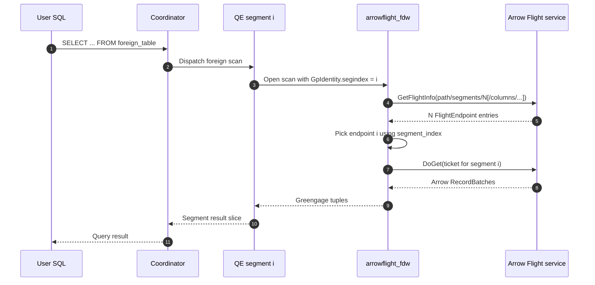
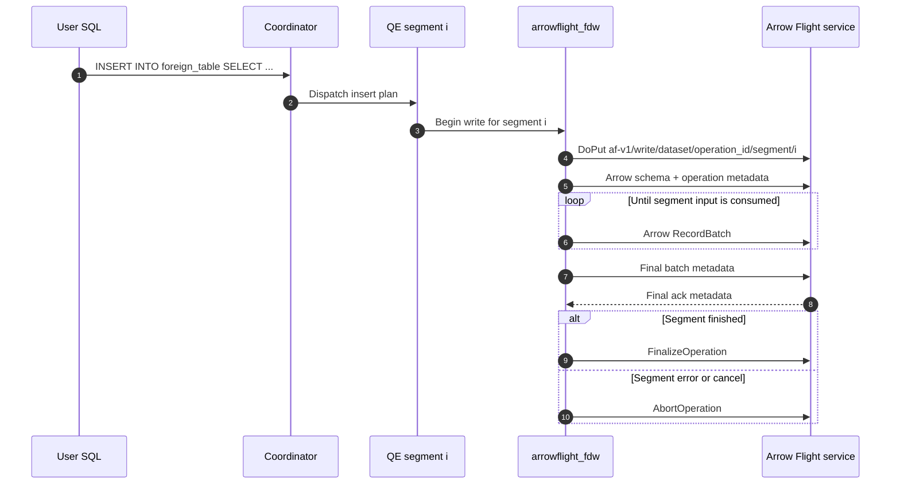

# Greengage Arrow Flight Extension

`gpcontrib/arrowflight` is an experimental Greengage Database extension that
connects Greengage segments to Apache Arrow Flight services.

The extension provides the `arrowflight_fdw` foreign data wrapper for
segment-parallel reads and staged writes.

The helper daemon in `tools/arrowflightd.cpp` is a development/test Arrow
Flight service. It is useful for contract testing and benchmarks, but it is not
a production data service.

## Why this exists

Greengage can already move external data through `gpfdist` and other
file-oriented paths. These paths are reliable, but text/file formats are
inefficient for service-backed columnar exchange: typed values are serialized
to larger text payloads, parsed back on segments, and often pass through
staging or format-conversion steps.

Arrow Flight provides a typed binary RecordBatch stream over gRPC.
`arrowflight_fdw` uses it to keep data exchange segment-parallel, reduce
formatting/parsing overhead, and carry write metadata such as segment identity,
finalization, and abort information.

## Architecture

### Components

```text
Greengage SQL
  |
  | CREATE EXTENSION arrowflight
  |
  +-- Foreign data wrapper: arrowflight_fdw
        |
        +-- read path
        |     GetFlightInfo -> FlightEndpoint/Ticket -> DoGet
        |     Arrow batches -> projected Datum slots
        |
        +-- write path
              INSERT on QE segments -> DoPut
              RecordBatch stream + schema metadata
              FinalizeOperation / AbortOperation actions
```

`arrowflight_fdw` is created with `OPTIONS (mpp_execute 'all segments')`, so
servers inherit segment execution unless they override `mpp_execute`. With this
placement, each segment reads or writes its own part of the Flight stream.
Coordinator-only execution is supported by the FDW framework, but it removes
segment parallelism.

Execution placement affects the Flight contract:

- `all segments` is the extension default. The FDW runs on QE segments; each
  segment has its own `GpIdentity.segindex`, consumes the matching
  `FlightEndpoint` for reads, and opens its own `DoPut` stream for writes.
- `coordinator` can be set explicitly for single-endpoint read tests. The
  foreign scan runs only on the coordinator, so there is no segment id for
  `flight_endpoint_policy=segment_index`. `INSERT` is not supported in this
  placement.

### Read Sequence

The normal read path uses `mpp_execute 'all segments'` and one endpoint per
Greengage segment.



With a direct `url` read, the FDW treats the URL as a ready `DoGet` ticket by
default and skips `GetFlightInfo`.

### Write Sequence

`INSERT` also runs on QE segments. Each segment opens its own `DoPut` stream and
the receiving service uses the operation metadata to stage, finalize, or abort
the load.



Finalize and abort actions are sent by the segment writer. The external service
owns the durable commit/rollback semantics for the shared `operation_id`.

### Source Layout

```text
gpcontrib/arrowflight/
  arrowflight--1.0.sql        extension objects
  Makefile                    Greengage extension build
  src/
    arrowflight.cpp           SQL entrypoints and build info
    arrowflight_common.cpp    URL, option, metadata, and type helpers
    arrowflight_reader.cpp    Arrow Flight read client and Arrow -> Datum path
    arrowflight_fdw.cpp       FDW read planner/executor callbacks
    arrowflight_fdw_write.cpp FDW write planner/executor callbacks
    arrowflight_fdw_writer.cpp Arrow Flight DoPut writer
    include/                  internal declarations
  tools/
    arrowflightd.cpp          development/test service wrapper
    arrowflight_smoke_server.cpp
    run_arrowflight_*.sh      smoke, correctness, and benchmark scripts
```

## Interaction Contracts

### Recommended FDW Shape

Keep endpoint, execution placement, and connection defaults on the foreign
server:

```sql
CREATE SERVER arrowflight_srv
    FOREIGN DATA WRAPPER arrowflight_fdw
    OPTIONS (
        mpp_execute 'all segments',
        host '127.0.0.1',
        port '8815',
        -- Plaintext is for development and tests. Production deployments
        -- should configure TLS, mTLS client credentials, and a Bearer token.
        -- tls 'true',
        -- tls_ca_file '/etc/greengage/arrowflight/ca.pem',
        -- tls_client_cert_file '/etc/greengage/arrowflight/client.pem',
        -- tls_client_key_file '/etc/greengage/arrowflight/client.key',
        -- auth_token_file '/etc/greengage/arrowflight/token',
        timeout_ms '60000',
        retry_count '1',
        retry_backoff_ms '50',
        use_get_flight_info 'true',
        flight_endpoint_policy 'segment_index',
        projection_pushdown 'try',
        write_mode 'staging'
        );
```

Foreign tables declare a schema and a remote `path`. `SELECT` and `INSERT`
use different Flight RPC contracts for that path, so the external service must
implement the operation that the SQL statement invokes.

### Option Model

Server options are defaults for all foreign tables that use that server. Table
options override server options when the same option is valid in both places.
Use relative `path` for regular foreign tables. With `path`, read queries use
`GetFlightInfo` and segment-index endpoint selection by default. Absolute
`url` is an advanced form for a complete Flight endpoint or direct ticket.

#### Server Options

| Option                   | Default                    | Used by    | Description                                                                                                                      |
|--------------------------|----------------------------|------------|----------------------------------------------------------------------------------------------------------------------------------|
| `mpp_execute`            | `all segments`             | read/write | Execution placement inherited from `arrowflight_fdw`. Use `coordinator` only for single-endpoint read tests.                     |
| `host`                   | none                       | read/write | Arrow Flight service host used by relative table `path` definitions. Required unless every table uses absolute `url`.            |
| `port`                   | none                       | read/write | Arrow Flight service port used by relative table `path` definitions. Required unless every table uses absolute `url`.            |
| `tls`                    | `false`                    | read/write | Select gRPC TLS transport. Required for all mTLS and Bearer auth file options.                                                   |
| `tls_ca_file`            | none                       | read/write | CA PEM used to verify the Arrow Flight server certificate. Server-level only.                                                    |
| `tls_client_cert_file`   | none                       | read/write | GreengageDB client certificate PEM for mTLS. Must be provided with `tls_client_key_file`. Server-level only.                     |
| `tls_client_key_file`    | none                       | read/write | GreengageDB client private key PEM for mTLS. Must be provided with `tls_client_cert_file`. Server-level only.                    |
| `auth_token_file`        | none                       | read/write | Bearer token file. The FDW sends `Authorization: Bearer <token>` on every Flight RPC. Server-level only and requires `tls=true`. |
| `timeout_ms`             | `-1`                       | read/write | gRPC call timeout. `-1` means no explicit timeout.                                                                               |
| `retry_count`            | `0`                        | read/write | Retries before the first read batch is consumed or before the write stream sends rows. Maximum is `10`.                          |
| `retry_backoff_ms`       | `100`                      | read/write | Sleep between retries. Maximum is `60000`.                                                                                       |
| `batch_rows`             | `8192`                     | write      | Default maximum rows buffered before the writer flushes a RecordBatch.                                                           |
| `max_batch_bytes`        | `4194304`                  | write      | Writer flush target. `0` disables writer byte-based flushing. Read accepts this option but does not enforce remote batch sizing. |
| `use_get_flight_info`    | `true` for `path`          | read       | Regular `path` tables call `GetFlightInfo` first, then `DoGet`. Direct `url` tables skip `GetFlightInfo` unless this is set.     |
| `flight_endpoint_policy` | `segment_index` for `path` | read       | Endpoint selection policy for `GetFlightInfo`. Direct `url` tables use the first endpoint unless this is set.                    |
| `projection_pushdown`    | `off`                      | read       | `off`, `try`, or `require`. With `use_get_flight_info=true`, projected column names are sent in the `GetFlightInfo` request.     |
| `write_mode`             | `staging`                  | write      | Service-side write semantic mode for `INSERT`. Current values are `staging` and `append`; this is not a read/write selector.     |

#### Foreign Table Options

| Option                   | Default        | Used by    | Description                                                                                                                                                                             |
|--------------------------|----------------|------------|-----------------------------------------------------------------------------------------------------------------------------------------------------------------------------------------|
| `path`                   | none           | read/write | Relative route under the server endpoint. Use `dataset/<dataset>` for a table that should support both `SELECT` and `INSERT`. Plain `<dataset>` paths are accepted for insert-only DDL. |
| `url`                    | none           | read/write | Absolute `arrowflight://host:port/...` endpoint. Prefer `path` for regular foreign tables.                                                                                              |
| `rows`                   | `1000`         | read       | Optional planner row estimate. This is not a row limit and does not affect remote data volume.                                                                                          |
| `operation_metadata`     | empty          | write      | Comma- or semicolon-separated static metadata for the receiving service, restricted to `static.*` and `af.static.*` keys.                                                               |
| `batch_rows`             | server/default | write      | Table override for write RecordBatch row flushing.                                                                                                                                      |
| `max_batch_bytes`        | server/default | write      | Table override for writer flush byte target. Read accepts this option but does not enforce remote batch sizing.                                                                         |
| `timeout_ms`             | server/default | read/write | Table override for gRPC call timeout.                                                                                                                                                   |
| `retry_count`            | server/default | read/write | Table override for retry count.                                                                                                                                                         |
| `retry_backoff_ms`       | server/default | read/write | Table override for retry backoff.                                                                                                                                                       |
| `use_get_flight_info`    | server/default | read       | Table override for `GetFlightInfo` endpoint resolution.                                                                                                                                 |
| `flight_endpoint_policy` | server/default | read       | Table override for `GetFlightInfo` endpoint selection.                                                                                                                                  |
| `projection_pushdown`    | server/default | read       | Table override for projection pushdown behavior.                                                                                                                                        |
| `write_mode`             | server/default | write      | Optional table override for service-side write semantics. Current values are `staging` and `append`.                                                                                    |

#### Foreign Column Options

| Option                      | Default      | Used by                | Description                                                                                                                                                   |
|-----------------------------|--------------|------------------------|---------------------------------------------------------------------------------------------------------------------------------------------------------------|
| `insert_dist_by_key`        | `false`      | insert target planning | Marks this foreign-table column as part of the insert target distribution policy. Intended for connector-created temporary tables, not hand-written user DDL. |
| `insert_dist_by_key_weight` | column order | insert target planning | Non-negative order for multi-column distribution keys. Lower values come first.                                                                               |

Keep secrets in server-level file options. Do not put tokens, private keys, or
certificate contents in table options, `path`, or `url`. Plain `tls=false` is
intended for local development and tests; production deployments should use
TLS, client certificate/key, CA, and Bearer token files on the foreign server.

Absolute `url` values can be used when a table needs a complete Flight
endpoint. For read paths, URL query parameters such as
`tls`, `timeout_ms`, `max_batch_bytes`, `retry_count`, `retry_backoff_ms`,
`use_get_flight_info`, `flight_endpoint_policy`, and `projection_pushdown`
override DDL defaults. For write paths, prefer DDL options for
timeout/retry/batching; the writer uses the URL as the Flight endpoint and
ticket source, with optional `tls` endpoint selection.

In direct `url` read mode, the URL is treated as a ready `DoGet` ticket by
default. If `use_get_flight_info=true` is set on a direct URL, the URL ticket is
used as the `GetFlightInfo` descriptor and `flight_endpoint_policy` selects one
of the returned endpoints.

Read-only URL query parameters `profile=true` and `profile_label=<label>` are
debug hooks used by the benchmark scripts. They are not server or table
options.

Unsafe characters in path/query values must be percent-encoded. Raw spaces,
braces, and percent signs are rejected.

For one foreign table that can be both read and written, use the canonical
dataset path:

```sql
CREATE FOREIGN TABLE events (
    id int4,
    label text,
    active bool,
    amount float8,
    d date,
    ts timestamp,
    tstz timestamptz
    )
    SERVER arrowflight_srv
    OPTIONS (
        path 'dataset/events',
        operation_metadata 'static.source=load_job,static.job_id=job_001'
        );

SELECT *
FROM events;

INSERT INTO events
SELECT *
FROM source_table;
```

The remote service decides whether `INSERT` commits into the same dataset that
`SELECT` reads. The FDW passes the same logical dataset name through both
protocol paths.

### Read FDW Contract

For `SELECT`, the table `path` identifies the remote dataset or route:

```sql
CREATE FOREIGN TABLE bench_read (
    id int4,
    segid int4,
    label text,
    active bool,
    amount float8,
    d date,
    ts timestamp
    )
    SERVER arrowflight_srv
    OPTIONS (
        path 'dataset/bench',
        rows '200000'
        );
```

`rows` is optional and only informs the planner cost estimate. It is not a row
limit and does not affect how much data the service sends.

Do not include the segment count in table DDL. For example, on a cluster with
two primary segments the table still uses a stable path:

```sql
OPTIONS
    (path 'dataset/bench')
```

When a query runs, the FDW reads the current segment count with
`getgpsegmentCount()` and sends this `GetFlightInfo` request to the service:

```text
dataset/bench/segments/2
```

The service must return one endpoint per Greengage segment. For the example
above it returns two endpoints, usually with tickets like:

```text
endpoint 0 -> ticket af-v1/dataset/bench/segment/0
endpoint 1 -> ticket af-v1/dataset/bench/segment/1
```

Then each QE segment reads its own endpoint:

```text
Greengage segment 0 -> DoGet(ticket af-v1/dataset/bench/segment/0)
Greengage segment 1 -> DoGet(ticket af-v1/dataset/bench/segment/1)
```

If the cluster is rebalanced to four primary segments, the foreign table DDL
does not change. The next query sends:

```text
dataset/bench/segments/4
```

and the service must return four endpoints. This is why users should not put
`segments/2` or `segments/4` into the table `path`.

Absolute `url` is different: it is for a complete direct endpoint or ticket.
Use it only when the table should bypass this path-to-`GetFlightInfo` flow.

When `projection_pushdown=try` or `projection_pushdown=require` is set and the
query references only some columns, the FDW adds that column list to the
`GetFlightInfo` request. For example:

```sql
SELECT id, label, amount
FROM bench_read;
```

uses:

```text
dataset/bench/segments/2/columns/id,label,amount
```

Column names are percent-encoded inside the comma-separated list. The service
should return `FlightInfo` and `DoGet` batches with only those fields, in the
requested names. `projection_pushdown=try` accepts a full-schema fallback;
`projection_pushdown=require` fails if the service does not return a reduced
schema. Projection pushdown is disabled for zero-column scans such as plain
`count(*)`, because the read stream still needs row batches to count rows.

### Write FDW Contract

For an `INSERT` workflow, the table `path` points at the target dataset route.
Use `dataset/<dataset>` when the table should also be readable through the
normal `SELECT` contract. Write-specific table options, such as
`operation_metadata` and `batch_rows`, only affect `INSERT` execution; they do
not mark the table as write-only.

```sql
CREATE FOREIGN TABLE events_write (
    id int4,
    label text,
    active bool,
    amount float8,
    d date,
    ts timestamp,
    tstz timestamptz
    )
    SERVER arrowflight_srv
    OPTIONS (
        path 'dataset/events',
        operation_metadata 'static.source=load_job,static.job_id=job_001',
        batch_rows '8192',
        max_batch_bytes '4194304',
        retry_count '0'
        );

INSERT INTO events_write
SELECT *
FROM source_table;
```

For writes, only `INSERT` is supported; `UPDATE` and `DELETE` are not
implemented. The writer opens one `DoPut` stream per executing segment. The
dataset name is derived from the table `path`:

- `path 'dataset/events'` derives dataset `events`.
- `path 'events'` also derives dataset `events`, but it is useful only for
  insert-only tables because read services commonly expect the `dataset/`
  prefix.

The writer includes the derived dataset as `af.dataset` in Arrow schema
metadata, the `DoPut` Flight descriptor, and the `FinalizeOperation` /
`AbortOperation` action bodies. The descriptor has this shape:

```text
af-v1/write/<dataset>/<operation_id>/segment/<segment_index>
```

When `url` is omitted, INSERT builds the endpoint from server `host`/`port` and
the table `path`. Connection, batching, retry, timeout, and `write_mode`
defaults can be configured on the server and overridden per table.

The Arrow schema carries operation metadata. Reserved metadata keys include:

- `af.protocol.version`
- `af.operation.id`
- `af.operation.type`
- `af.operation.mode`
- `af.dataset`
- `af.stream.id`
- `af.stream.attempt`
- `af.segment.index`
- `af.segment.count`
- `af.session.id`
- `af.command.count`
- `af.pid`

`af.operation.mode` contains the `write_mode` value, currently `staging` or
`append`; it never contains `read` or `write`.

User-supplied operation metadata is accepted only in the `static.*` or
`af.static.*` namespaces. This keeps service-owned `af.*` metadata protected
while still allowing a receiving service to route, audit, or enrich the
operation. Example:

```text
static.source=pxf_like_ingest,static.job_id=job_001,static.tenant=analytics
```

After the stream completes, the client expects a final metadata ack:

```text
af.ack.final=true
```

The client then sends a `FinalizeOperation` action. On error or interruption it
attempts `AbortOperation`. Both action bodies include operation id, dataset,
segment index/count, row count, batch count, session id, command count, and pid.

The development test service records `write_mode` for assertions. Durable
commit and rollback semantics are implemented by the receiving service.

### Type Mapping

Current native read/write mappings:

| Greengage type                            | Arrow type                                                                                  |
|-------------------------------------------|---------------------------------------------------------------------------------------------|
| `bool`                                    | `bool`                                                                                      |
| `int2`                                    | `int16`                                                                                     |
| `int4`, `serial`                          | `int32`                                                                                     |
| `int8`, `bigserial`                       | `int64`                                                                                     |
| `float4`                                  | `float32`                                                                                   |
| `float8`                                  | `float64`                                                                                   |
| `text`, `varchar`, `varchar(n)`, `bpchar` | `utf8`                                                                                      |
| `uuid`                                    | `fixed_size_binary(16)`; read also accepts string-like UUIDs                                |
| `interval`                                | `month_day_nano_interval`; read also accepts string-like intervals                          |
| `date`                                    | `date32`; read also accepts day-aligned `date64`                                            |
| `timestamp`                               | finite Arrow timestamp without timezone                                                     |
| `timestamptz`                             | finite Arrow timestamp with empty, `UTC`, or `Etc/UTC` timezone on read; writer emits `UTC` |
| enum                                      | dictionary-encoded UTF-8 labels or string-like labels                                       |
| `json`, `jsonb`, arrays                   | UTF-8 text exchange through the type input/output functions                                 |

Unsupported projected read columns fail deterministically during schema
validation. FDW projection-aware decode validates and converts only columns
needed by the plan; unprojected unsupported columns can be present in the remote
schema as long as the query does not reference them.

With `projection_pushdown=try` or `projection_pushdown=require`, a service that
supports this option can avoid sending unprojected columns. Reduced schemas are
mapped back to Greengage slots by Arrow field name.

## Benchmarks

### Environment

The latest benchmark run used:

- an Ubuntu Docker image built from `ci/Dockerfile.ubuntu` with
  `WITH_ARROW_FLIGHT_DEPS=true` on an Apple M4-Max: 64GB RAM & 16 CPU core host;
- Apache Arrow / Arrow Flight `24.0.0`;
- Greengage `gpdemo` with 2 primary segments and no mirrors;
- 20,000,000 rows total, 10,000,000 rows per segment;
- mixed schema: `id int4, segid int4, label text, active bool, amount float8,
  d date, ts timestamp`;
- `batch_rows=8192`, `max_batch_bytes=4MB`, `optimizer=off`;
- one warmup run and three measured runs;
- loopback network counters from `lo` as `rx+tx`.

Loopback counters are not production wire bytes. They are useful for same-run
relative comparison, but a production network claim needs a multi-host run on
the segment-facing NIC.

### Read Benchmark

The read harness compares:

- `arrow_flight_fdw`: FDW direct-slot read path;
- `gpfdist_csv`: readable external table over CSV.

Command shape:

```bash
ARROWFLIGHT_BENCH_SOURCE=ipc \
ARROWFLIGHT_BENCH_PROFILE=1 \
ARROWFLIGHT_BENCH_NET_DEV=lo \
ARROWFLIGHT_BENCH_SEGMENTS=2 \
ARROWFLIGHT_BENCH_ROWS_PER_SEGMENT=10000000 \
ARROWFLIGHT_BENCH_REPEATS=3 \
ARROWFLIGHT_BENCH_WARMUPS=1 \
bash tools/run_arrowflight_benchmark.sh
```

Latest median results:

| Method             |     Rows/s | CPU sec/logical GB | CPU sec/source GB | Source MB | Source B/row |  Net MB | Net B/row | Wall sec | p50 segment ms | p95 segment ms |
|--------------------|-----------:|-------------------:|------------------:|----------:|-------------:|--------:|----------:|---------:|---------------:|---------------:|
| `arrow_flight_fdw` | 16,026,479 |               1.55 |              2.08 |   1224.15 |        64.18 | 2460.14 |    129.03 |    1.248 |         1174.5 |         1178.0 |
| `gpfdist_csv`      |  2,931,096 |               8.56 |              8.56 |   1646.68 |        86.33 | 3297.81 |    172.90 |    6.823 |         6379.0 |         6392.0 |

Read conclusion:

- `arrowflight_fdw` is the fastest measured read path in this benchmark.
- It is about `5.47x` faster than `gpfdist_csv` on rows/s in the latest run.
- It uses about `5.52x` less CPU per logical GB than `gpfdist_csv`.
- Loopback bytes are about `25.4%` lower than `gpfdist_csv`, which matches the
  expected binary-vs-text payload reduction for this dataset.
- Arrow IPC source bytes are about `25.7%` lower than CSV source bytes.

### Write Benchmark

The write harness compares:

- `arrow_flight_fdw_write`: writable FDW using Arrow Flight `DoPut`;
- `gpfdist_csv_write`: writable external table over CSV.

Command shape:

```bash
ARROWFLIGHT_WRITE_BENCH_NET_DEV=lo \
ARROWFLIGHT_WRITE_BENCH_SEGMENTS=2 \
ARROWFLIGHT_WRITE_BENCH_ROWS_PER_SEGMENT=10000000 \
ARROWFLIGHT_WRITE_BENCH_REPEATS=3 \
ARROWFLIGHT_WRITE_BENCH_WARMUPS=1 \
bash tools/run_arrowflight_write_benchmark.sh
```

The timed operation is only:

```sql
INSERT INTO target
SELECT *
FROM af_bench_write_source;
```

DDL, setup, and validation are outside the timed run. Arrow write validation
reads the written operation back through `written/<operation_id>/segments/<N>`.
gpfdist validation parses emitted CSV files.

Latest median results:

| Method                   |     Rows/s | CPU sec/logical GB | CPU sec/write GB | Write MB | Write B/row |  Net MB | Net B/row | Wall sec | p50 segment ms | p95 segment ms |
|--------------------------|-----------:|-------------------:|-----------------:|---------:|------------:|--------:|----------:|---------:|---------------:|---------------:|
| `arrow_flight_fdw_write` | 13,259,925 |               1.99 |             2.68 |  1223.10 |       64.13 | 2452.45 |    128.58 |    1.508 |          321.0 |          326.0 |
| `gpfdist_csv_write`      |  4,057,542 |               5.23 |             5.23 |  1646.68 |       86.33 | 3304.16 |    173.23 |    4.929 |          358.5 |          382.0 |

Write conclusion:

- Arrow Flight write is about `3.27x` faster than writable `gpfdist` CSV.
- CPU per logical GB is about `2.63x` lower for Arrow Flight write.
- Estimated Arrow buffer bytes are about `25.7%` smaller than actual gpfdist
  CSV output bytes for this dataset.
- Loopback bytes are about `25.8%` lower for Arrow Flight write.

## Build and Run

### Build Inside a Greengage Source Tree

Build without Arrow Flight linkage. This keeps the extension installable for
basic SQL tests, but real Flight I/O is not available:

```bash
make -C gpcontrib/arrowflight
make -C gpcontrib/arrowflight install
```

Build with Arrow Flight linkage:

```bash
make -C gpcontrib/arrowflight USE_ARROW_FLIGHT=1
make -C gpcontrib/arrowflight install USE_ARROW_FLIGHT=1
```

The build expects `pkg-config --cflags --libs arrow arrow-flight` to work when
`USE_ARROW_FLIGHT=1` is enabled.

### Build and Test with Docker

Docker is not required by the extension. It is only a reproducible way to get a
prepared Greengage build environment with matching Apache Arrow C++ development
packages.

The Docker image is built from this repository. The standard CI Dockerfiles keep
Arrow C++ dependencies opt-in; `WITH_ARROW_FLIGHT_DEPS=true` adds Apache Arrow
C++ and Arrow Flight development packages so `USE_ARROW_FLIGHT=1` can link the
native Flight client.

Build the Ubuntu image from the Greengage source tree root:

```bash
docker build -t gpdb7_u22_arrowflight:latest \
  --build-arg WITH_ARROW_FLIGHT_DEPS=true \
  -f ci/Dockerfile.ubuntu .
```

The same build argument is available for the Rocky Linux CI image:

```bash
docker build -t gpdb7_regress_arrowflight:latest \
  --build-arg WITH_ARROW_FLIGHT_DEPS=true \
  -f ci/Dockerfile .
```

If the build context contains `.git`, the CI build scripts derive build
metadata from reachable Git tags. For shallow or tagless mirrors, fetch tags
before building the full image.

You can verify that the image has the Arrow C++ development files available:

```bash
docker run --rm gpdb7_u22_arrowflight:latest \
  bash -lc 'pkg-config --exists arrow arrow-flight'
```

Run extension regressions with the standard CI installcheck script. The script
installs Greengage from the image tarball, configures the source tree, creates a
demo cluster, builds and installs `arrowflight`, and then runs the extension
regression tests:

```bash
docker run --name gpdb7_arrowflight_installcheck --rm \
  --sysctl "kernel.sem=500 1024000 200 4096" \
  -e TEST_OS=ubuntu \
  -e MAKE_TEST_COMMAND="-C gpcontrib/arrowflight install USE_ARROW_FLIGHT=1 && make -s -C gpcontrib/arrowflight installcheck USE_ARROW_FLIGHT=1" \
  gpdb7_u22_arrowflight:latest \
  /home/gpadmin/gpdb_src/concourse/scripts/ic_gpdb.bash
```

### Build with PGXS

```bash
cd gpcontrib/arrowflight
make USE_PGXS=1 USE_ARROW_FLIGHT=1
make USE_PGXS=1 USE_ARROW_FLIGHT=1 install
```

### Build the Development Test Service

```bash
cd gpcontrib/arrowflight
g++ -std=c++20 -O2 tools/arrowflightd.cpp -o /tmp/arrowflightd \
  $(pkg-config --cflags --libs arrow arrow-flight)
```

Run it:

```bash
/tmp/arrowflightd 8815
```

### Use in SQL

```sql
CREATE EXTENSION arrowflight;

SELECT arrowflight_build_info();

CREATE SERVER arrowflight_srv
    FOREIGN DATA WRAPPER arrowflight_fdw
    OPTIONS (
        mpp_execute 'all segments',
        host '127.0.0.1',
        port '8815',
        timeout_ms '60000',
        retry_count '1',
        retry_backoff_ms '50',
        use_get_flight_info 'true',
        flight_endpoint_policy 'segment_index',
        projection_pushdown 'try',
        write_mode 'staging'
        );
```

`SELECT` workflow example:

```sql
CREATE FOREIGN TABLE bench_read (
    id int4,
    segid int4,
    label text,
    active bool,
    amount float8,
    d date,
    ts timestamp
    )
    SERVER arrowflight_srv
    OPTIONS (
        path 'dataset/bench',
        rows '20000000'
        );

SELECT count(*), sum(id), sum(segid)
FROM bench_read;
```

`rows` is optional and only informs the planner cost estimate. It does not limit
rows returned by the service.

`INSERT` workflow example:

```sql
CREATE FOREIGN TABLE bench_write (
    id int4,
    segid int4,
    label text,
    active bool,
    amount float8,
    d date,
    ts timestamp
    )
    SERVER arrowflight_srv
    OPTIONS (
        path 'dataset/bench_write',
        operation_metadata 'static.source=manual_test',
        batch_rows '8192',
        max_batch_bytes '4194304',
        retry_count '0'
        );

INSERT INTO bench_write
SELECT *
FROM local_source_table;
```

### Smoke and Benchmark Scripts

The scripts assume a Greengage development environment with `GPHOME`,
`GPDEMO_DIR`, and `/tmp/arrowflightd` available. If they run inside a Docker
container, `sshd` must be running before creating a `gpdemo` cluster.

Smoke tests:

```bash
bash tools/run_arrowflight_fdw_smoke.sh
bash tools/run_arrowflight_fdw_write_smoke.sh
bash tools/run_arrowflight_fdw_orca_smoke.sh
```

Benchmarks:

```bash
bash tools/run_arrowflight_benchmark.sh
bash tools/run_arrowflight_write_benchmark.sh
```

Both benchmark scripts write CSV, JSON, Markdown summaries, and service logs
under their configured result directories.

### DuckDB Docker Compose Integration

The DuckDB compose integration runs a real external Arrow Flight service backed
by DuckDB and a Greengage runner container in the same Compose network.

Run the end-to-end integration check:

```bash
bash tools/run_arrowflight_duckdb_compose.sh
```

The runner:

- builds the `duckdb-flight` image with `duckdb` and `pyarrow`;
- starts `duckdb-flight` and a Greengage build container;
- rebuilds and installs `arrowflight.so` with `USE_ARROW_FLIGHT=1` inside the
  Greengage container;
- creates a two-segment `gpdemo` cluster;
- validates `GetFlightInfo -> DoGet` reads from a DuckDB `sales` table;
- validates `DoPut -> FinalizeOperation` writes into a DuckDB `sales_write`
  table and reads the committed data back through the FDW.

Set `ARROWFLIGHT_DUCKDB_KEEP_COMPOSE=1` to keep the containers and network after
the run for debugging.

To bring up the same environment for manual SQL work:

```bash
bash tools/setup_arrowflight_duckdb_compose.sh
```

The setup command leaves both containers running, creates a two-segment `gpdemo`
cluster, installs the `arrowflight` extension, and creates these objects in the
`postgres` database:

- `duckdb_sales`: readable foreign table backed by the DuckDB `sales` table.
- `duckdb_sales_write`: foreign table that writes to and reads back the DuckDB
  `sales_write` table through the same `path 'dataset/sales_write'` contract.
- `duckdb_write_source`: local Greengage source table for manual write tests.

Connect to Greengage through the container:

```bash
docker compose -p arrowflight-duckdb -f docker-compose.duckdb.yml exec greengage \
  runuser -u gpadmin -- bash -lc \
  'source /home/gpadmin/greengage-db-devel/greengage_path.sh; source /home/gpadmin/gpdb_src/gpAux/gpdemo/gpdemo-env.sh; psql postgres'
```

Greengage connection details inside the container:

- database: `postgres`
- user: `gpadmin`
- password: none, local trust inside the development container
- coordinator port: `7000`

The compose file also maps the coordinator to host port
`${ARROWFLIGHT_GG_PORT:-7000}`. Host `psql` can be used only when the local
client and container `pg_hba.conf` permit it:

```bash
psql -h localhost -p 7000 -U gpadmin -d postgres
```

Run manual Greengage checks:

```sql
SELECT count(*), sum(id), sum(segid)
FROM duckdb_sales;

INSERT INTO duckdb_sales_write
SELECT *
FROM duckdb_write_source;

SELECT count(*), sum(id), sum(segid)
FROM duckdb_sales_write;
```

Query DuckDB through the debug SQL endpoint exposed by the test Flight service:

```bash
curl -s -X POST http://localhost:8816/query \
  --data 'SELECT count(*), sum(id), sum(segid) FROM sales'

curl -s -X POST http://localhost:8816/query \
  --data 'SELECT count(*), sum(id), sum(segid) FROM sales_write'
```

DuckDB/Flight service endpoints:

- Arrow Flight server from Greengage: `host='duckdb-flight', port='8815'`
- Arrow Flight from host: `localhost:8815`
- DuckDB debug SQL endpoint from host: `http://localhost:8816/query`
- authentication/TLS: none; local development only

Stop and remove the manual environment:

```bash
docker compose -p arrowflight-duckdb -f docker-compose.duckdb.yml down -v
```

## Current Limitations and Assumptions

- The extension is experimental.
- `tools/arrowflightd.cpp` is a development/test service, not a production
  Arrow Flight service.
- `tls=false` is suitable only for trusted dev/test networks. Production should
  use `tls=true` with `tls_ca_file`, `tls_client_cert_file`,
  `tls_client_key_file`, and `auth_token_file`.
- TLS certificates must cover the configured Flight host in their SAN. Token
  files can be rotated in place; certificate, key, and CA changes require a
  process restart.
- IPv6 Arrow Flight URLs are not supported.
- FDW writes support `INSERT` only; `UPDATE`, `DELETE`, and `COPY` are not
  implemented.
- Writes use staged finalization. Durable commit/rollback behavior is
  implemented by the receiving service.
- Retry is limited to the initial read/open path or write stream opening. After
  rows have been consumed or sent, the FDW does not retry automatically.
- Remote projection pushdown is implemented for the FDW `GetFlightInfo` path
  with `projection_pushdown=try|require`. Direct `DoGet(ticket)` URLs and
  zero-column scans still use the full remote schema.
- `max_batch_bytes` controls writer flushing, but it is not a full memory limit
  for all Arrow/gRPC buffering.
- `timestamp` accepts Arrow timestamps without timezone. `timestamptz` accepts
  empty/UTC timezones on read and emits UTC on write. Non-UTC timezone semantics
  are rejected.
- Native Arrow temporal mappings do not encode Greengage temporal infinities.
  `date`, `timestamp`, and `timestamptz` infinities fail deterministically
  instead of using private sentinel values.
- Arrow `date64` values must be day-aligned. Arrow timestamp values must fit the
  finite Greengage timestamp range after unit conversion and epoch adjustment.
- `json`, `jsonb`, and arrays currently use UTF-8 text exchange, not native
  nested Arrow vectors.
- Benchmark network bytes are loopback `rx+tx` counters. Multi-host benchmarks
  are still required before making production network-capacity claims.
